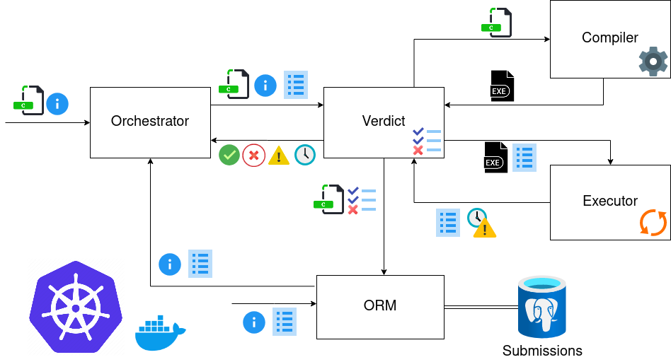

# Maratona-Runtime

[](https://pkg.go.dev/github.com/maratona-run-time/Maratona-Runtime?readme=expanded)
[](https://goreportcard.com/report/github.com/maratona-run-time/Maratona-Runtime)
[](https://codecov.io/gh/maratona-run-time/Maratona-Runtime)

Maratona Runtime implements the core service of judging solutions for ICPC and CTF-related coding competitions.

## Architecture

We are using a microservice architecture.
The system, for now, is separated in the following parts:

- **Verdict**: Receives information regarding problem and submission details.
- **Compiler**: Tasked with compiling a received source code and responding with the generated binary code (except for interpreted languages, such as Python).
- **Executor**: Executes a binary code or a interpreted language program against a set of inputs and responds with generated outputs.
- **Orchestrator**: Receives challenge submissions and is responsible for triggering their evaluation.
- **ORM**: Responsible for administering a PostgreSQL server and saving submissions and their verdicts.

Follows a visual representation of the communication between these services:



For now, the system can be started using the [docker-compose](docker-compose.yml).
The communication between the services is done via HTTP, using two docker networks:

- "maratona-net" supports general purpose communication between the Verdict, Compiler, Executor, Orchestrator and ORM.
- "database-net", on the other hand, only supports database-related communication, between the ORM and the Postgres database.

## Submissions Database

We are using a PostgreSQL database to store challenges and submissions details.


## Testing

All tests were developed using Go's "testing" package.

To run all tests on the project:

```go
go test ./...
```

For service-specific tests, search for "*_test.go" files, such as: "verdict_test.go".
One can execute those by running `go test` on the folder where they are located.

## Travis

All configuration is on the project's [travis yaml](.travis.yml) file.

Travis currently tests:

- If the project files are styled respecting official golang style guidelines (by using `gofmt`).
- If the project tests are running successfully
